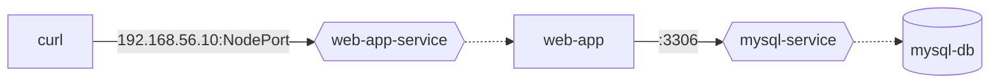

# Exercise 17

In this exercise, you will create a network policy allowing the web-app to query its database. The application stack consists of a web application implemented using node.js, and a MySQL database. The web application connects to the database upon requesting its endpoint. Web application and MySQL database run in a Pod. Both Pods have been exposed by a Service. The Service for the web application Pod is of type `NodePort`. The Service for the MySQL database is of type `ClusterIP`. By default, all ingress and egress traffic is not allowed in this namespace.

The following flowchart shows the high-level architecture.

I tried the troubleshooting exercise here: https://learning.oreilly.com/scenarios/cka-prep-troubleshooting/9781492099239/ 
Don't forget to list all in a namespace. I overlooked the presence of a daemonset
A daemonset is an object that runs copies of a pod on every node. Daemonsets ARE NAMESPACED. $ k get daemonsets -A
I got distracted by other pods failing. The question asked me to fix certain pods. I thought the other failing pods were a red herring. They were actually failing because of the initial failing pods. Fixing those (kube proxy), fixed the others (core dns)

CNI is specified in /etc/cni/net.d on the various nodes

Container network gets very complex: https://learnk8s.io/kubernetes-network-packets g

## Fixing the issue in namespace "network"

1. Create a new namespace named `network`.
2. Within the namespace, setup the configuration `kubectl -n network apply -f setup.yml`.
3. List all the objects and ensure that their status shows `Ready`.
4. The Pod running web application exposes the container port 3000. From your machine, execute `curl` or `wget` to access the application through the Service endpoint from outside of the cluster. A successful response should render `Successfully connected to database!`, a failure response should render `Failed to connect to database: <error message>`.
5. Add a new NetworkPolicy allowing web-app to connect to mysql-db only on port 3306.
6. The `curl` or `wget` command should now render the message `Successfully connected to database!`.
7. Delete the namespace `network`.
